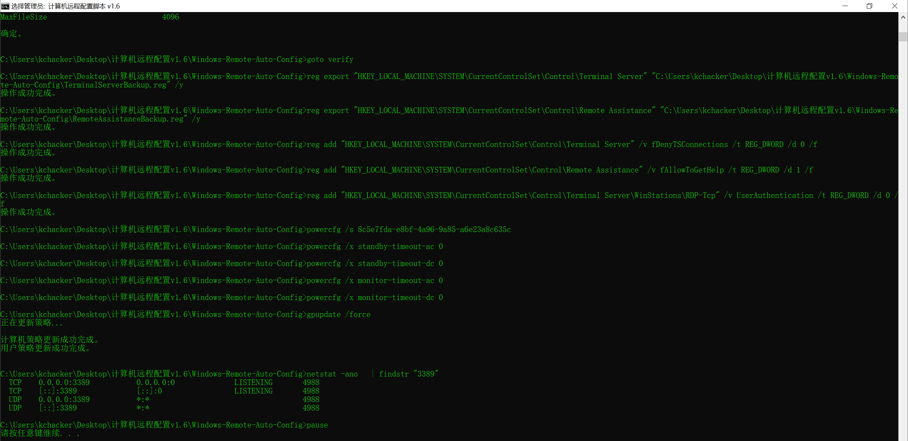

  <h1 align="center">基于 Windows 的远程自动配置脚本</h1>
  
  一个基于 Windows 的计算机远程配置脚本，用于设置和配置远程桌面服务及相关系统设置。

  
  
  
  
  

## 目录
- [功能](#功能)
- [项目使用约定](#项目使用约定)
- [详细功能说明](#详细功能说明)
  - [检查并提升为管理员权限](#1-检查并提升为管理员权限)
  - [注册表备份](#2-注册表备份)
  - [修改服务](#3-修改服务)
  - [替换系统文件并导入注册表](#4-替换系统文件并导入注册表)
  - [配置本地组策略编辑器](#5-配置本地组策略编辑器)
  - [添加用户组权限](#6-添加用户组权限)
  - [关闭防火墙](#7-关闭防火墙)
  - [修改远程桌面系统属性](#8-修改远程桌面系统属性)
  - [设置电源管理](#9-设置电源管理)
  - [更新本地组策略和检查远程端口](#10-更新本地组策略和检查远程端口)
  - [支持操作系统版本检测和条件执行](#11-支持操作系统版本检测和条件执行)
- [使用到的其他程序](#使用到的其他程序)
  - [Ntrights.exe](#1-ntrights.exe)
  - [Subinacl.exe](#2-subinacl.exe)
- [使用方法](#使用方法)
- [注意事项](#注意事项)

## 功能
1. 检查并提升为管理员权限
2. 注册表备份和恢复
3. 修改服务启动类型和状态
4. 替换系统文件并导入注册表
5. 配置本地组策略编辑器
6. 添加用户组权限
7. 关闭防火墙
8. 修改远程桌面系统属性
9. 设置电源管理
10. 更新本地组策略和检查远程端口
11. 支持操作系统版本检测和条件执行
12. `[新增]`自解压版本exe程序
13. **`[计划开发]`编译版本exe程序**

## 项目使用约定
本项目基于 GPL 3.0 协议开源，不禁止二次分发，但使用代码时请遵守如下规则：

1. 二次分发版必须同样遵循 GPL 3.0 协议，**开源且免费**。
2. **合法合规使用代码，禁止用于商业用途; 修改后的软件造成的任何问题由使用此代码的开发者承担**。
3. 打包、二次分发 **请保留代码出处**：。
4. 如果使用此代码的开发者不同意以上三条，则视为 **二次分发版中修改部分的代码遵守 CC0 协议**。
5. 如果开源协议变更，将在此 Github 仓库更新，不另行通知。

## 详细功能说明

### 1. 检查并提升为管理员权限
- 检查脚本是否以管理员身份运行，如果不是，则创建一个临时的 VBScript 文件来请求提升权限。

### 2. 注册表备份
- 导出以下注册表项：
  - `HKEY_LOCAL_MACHINE\SOFTWARE\Policies\Microsoft\Windows NT\Terminal Services` -> `CombinedBackup.reg`
  - `HKEY_LOCAL_MACHINE\SOFTWARE\Policies\Microsoft\Windows\Personalization` -> `PersonalizationBackup.reg`
  - `HKEY_LOCAL_MACHINE\SYSTEM\CurrentControlSet\Control\Terminal Server` -> `TerminalServerBackup.reg`
  - `HKEY_LOCAL_MACHINE\SYSTEM\CurrentControlSet\Control\Remote Assistance` -> `RemoteAssistanceBackup.reg`
- 注释了还原注册表的命令，可以根据需要取消注释，但需要重新保存为ANSI文件。

### 3. 修改服务
- 将 `SessionEnv`、`TermService` 和 `UmRdpService` 服务的启动类型设置为“自动”。
- 启动上述服务。

### 4. 替换系统文件并导入注册表
- 替换系统文件路径 `GroupPolicy`：
  - 将指定路径下的 `GroupPolicy` 文件复制到 `C:\Windows\System32\GroupPolicy`。
  - 导入 `Microsoft_output.reg` 注册表文件。

### 5. 配置本地组策略编辑器
- 修改注册表以配置以下组策略设置：
  - 远程桌面连接的安全层（设置为 RDP）
  - 允许用户通过远程桌面服务进行远程连接
  - 配置请求的远程协助
  - 不允许剪贴板重定向
  - 不显示锁屏

### 6. 添加用户组权限
- 使用 `ntrights.exe` 工具授予以下组的远程交互登录权限：
  - `Administrators`
  - `Remote Desktop Users`（在 Windows 11 上不可用）
  - `Users`

### 7. 关闭防火墙
- 使用 `netsh` 命令关闭所有配置文件的防火墙，并显示当前防火墙状态。

### 8. 修改远程桌面系统属性
- 启用远程桌面和远程协助。
- 禁用网络级别身份验证。

### 9. 设置电源管理
- 将电源计划设置为“高性能”。
- 将睡眠和显示器超时设置为“从不”。

### 10. 更新本地组策略和检查远程端口
- 强制更新本地组策略设置。
- 检查远程 `3389` 端口的状态。

### 11. 支持操作系统版本检测和条件执行
- 检测当前操作系统版本并根据版本执行相应的代码。
- 支持的操作系统包括 Windows XP、Windows 7、Windows 10（不支持 Windows 11）。

## 使用到的其他程序
### 1. Ntrights.exe
Ntrights 包含在 Windows Server 2003 资源工具包和 Windows 2000 资源工具包中。

**版本兼容性**：Windows Server 2003、Windows XP Professional 和 Windows 2000 支持 Ntrights。

Ntrights 是一个命令行工具，使您能够为本地或远程计算机上的用户或用户组分配或撤销权限。您还可以在计算机的事件日志中放置一个记录更改的条目。

Ntrights 在无人值守或自动安装中非常有用，在此期间您可能想要更改默认权限。您还可以在需要更改现有安装中的权限但无法访问和登录所有计算机的情况下使用该工具。

要查找有关 Ntrights 的更多信息，请参阅微软
[Ntrights 工具帮助](https://learn.microsoft.com/en-us/previous-versions/windows/it-pro/windows-server-2003/cc779140(v=ws.10)?redirectedfrom=MSDN)。

### 2.  Subinacl.exe
Subinacl是微软提供的用于对文件、注册表、服务等对象进行权限管理的工具软件。

微软官方警告，subinacl.exe 并不容易使用，事实上，它有时候简直就很迟钝。

不过subinad.exe 是管理存取控制的一个超强工具。每一位系统管理员都需要此工具。

要查找有关 Subinacl 的更多信息，请参阅微软
[安全性监控管理ACL 的工具](https://learn.microsoft.com/zh-tw/previous-versions/technet-magazine/cc138006(v=msdn.10))。

### 3.  Microsoft_output.reg
从远程功能正常的 `Windows 10` 系统计算机中导出的组策略配置文件。

### 4.  windows_xp_ghost.reg
从远程功能正常的 `Windows XP` 系统计算机中导出的组策略配置文件。

### 5.  GroupPolicy
从远程功能正常的 `Windows 10` 系统计算机中导出的系统文件。

## 使用方法
1. 确保 `ntrights.exe` 工具在脚本运行的路径中，或者修改脚本以指向正确的路径。
2. 确保 `subinacl.exe` 工具在脚本运行的路径中，或者修改脚本以指向正确的路径。
3. **版本1.5以前**：将脚本保存为 **ANSI** 编码格式的 `.bat` 文件，右键点击以管理员身份运行。
4. **版本1.6新增**：新增打包后的自解压exe文件，用户仅需运行自解压文件即可完成配置，默认解压文件到当前自解压文件所在路径的`./Windows-Remote-Auto-Config`目录。

## 注意事项
- 需要以管理员身份运行脚本。
- 确保在运行脚本前备份重要的注册表和系统设置。
- 根据实际需要调整和取消注释相应的命令。